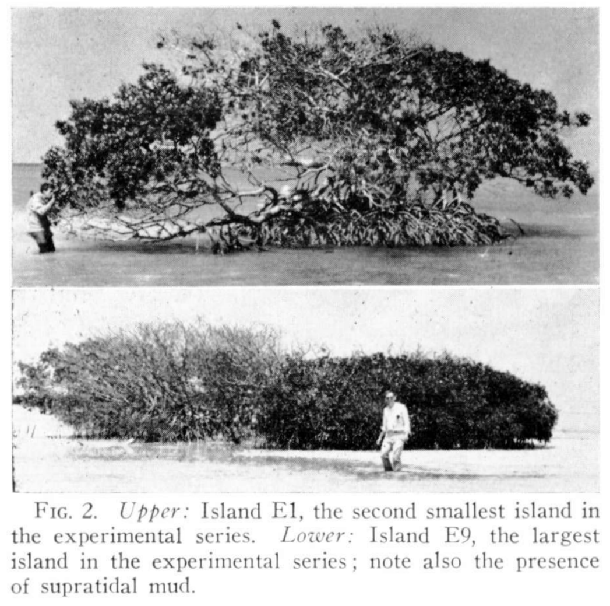

exclude: true

```{r setup, include=FALSE, echo=FALSE, message=FALSE, error=FALSE, include=FALSE, comment=FALSE}
options(htmltools.dir.version = FALSE)
xaringan::summon_remark()
library(tidyverse)
library(gt)

```

```{r xaringan-tile-view, echo=FALSE, message=FALSE, error=FALSE, include=FALSE, comment=FALSE}
xaringanExtra::use_tile_view()
xaringanExtra::use_webcam()
xaringanExtra::use_tachyons()
xaringanExtra::use_animate_css()
xaringanExtra::use_share_again()
#xaringanExtra::use_scribble(pen_color = "#56106E")
```

---
class: top left hide-count
background-image: url(img/giorgio-trovato-IclGoWB6wEY-unsplash.jpg)
background-size: cover

.move-top20[
.title-text[Empty Islands]  
.title-subtext[<span style='font-size:0.9em'>The Bacterial Ecology of Infection & Antibiotic Failure</span>]  
]  
  
.callout-url-leftcorner[
.title-nametext[
Brendan J. Kelly, MD, MS  
Infectious Diseases & Epidemiology  
University of Pennsylvania  
14 February 2022  <!-- `r format(Sys.Date(), '%d %B %Y')` -->   
]
]

.footnote-right[<span style='color: white'>photo: Giorgio Trovato @unsplash</span>]  


---

## Disclosures  

.pad-left[  

- No conflicts of interest.  

- Research supported by:

    - NIAID K23 AI121485  
    
    - CDC BAA 200-2016-91964  
    
    - CDC BAA 200-2016-91937  
    
    - CDC BAA 200-2018-02919  
    
    - CDC BAA 200-2021-10986   

]


---

## Objectives    
  
.pad-left[  
  
- How do antibiotics fail?  
  
    - failure of pathogen identification → wrong antibiotic       
    
    - high-grade phenotypic resistance or inadequate source control    
    
    - <u>post-antibiotic repopulation</u>  
    
- Bacterial ecology of infection: VAP, _C. difficile_  
  
- Microbiome change during & after antibiotics   
  
- Engineering post-antibiotic repopulation      
  
    
]  


---
class: top left hide-count
background-image: url(img/yudi-haryasa-HEpUyHwJuzQ-unsplash.jpeg)
background-size: cover

## <span style='color: #093b85;'>Introduction: Island Ecology</span>


.footnote-right[<span style='color: white'>photo: Yudi Haryasa @unsplash</span>]  


---
class: hide-count

.pull-left[
```{r, echo=FALSE, echo=FALSE, message=FALSE, warning=FALSE, error=FALSE, fig.align='center', out.width='55%'}
knitr::include_graphics(path = "img/tibg_title_authors.png")

```

```{r, echo=FALSE, echo=FALSE, message=FALSE, warning=FALSE, error=FALSE, fig.align='center', out.width='75%'}
knitr::include_graphics(path = "img/tibg_figure7_equilibrium_model.png")

```

]

.pull-right[

```{r, echo=FALSE, echo=FALSE, message=FALSE, warning=FALSE, error=FALSE, fig.align='center', out.width='80%'}
knitr::include_graphics(path = "img/wilson_simberloff_ecology_1969_fig3map.png")

```

```{r, echo=FALSE, echo=FALSE, message=FALSE, warning=FALSE, error=FALSE, fig.align='center', out.width='80%'}
knitr::include_graphics(path = "img/wilson_simberloff_ecology_1969_tab1.png")

```

]


.footnote-left[Macarthur & Wilson 1967; Simberloff & Wilson _Ecology_ 1969]


---
class: hide-count

.pull-left[

```{r, echo=FALSE, echo=FALSE, message=FALSE, warning=FALSE, error=FALSE, fig.align='center', out.width='90%'}
knitr::include_graphics(path = "img/wilson_simberloff_ecology_1969_fig2.png")
# 

```


]

.pull-right[
```{r, echo=FALSE, echo=FALSE, message=FALSE, warning=FALSE, error=FALSE, fig.align='center', out.width='90%'}
knitr::include_graphics(path = "img/wilson_simberloff_ecology_1969_fig8.png")
# 

```

]


.footnote-left[Wilson & Simberloff _Ecology_ 1969]


---
class: hide-count

.pull-left[

```{r, echo=FALSE, echo=FALSE, message=FALSE, warning=FALSE, error=FALSE, fig.align='center', out.width='90%'}
knitr::include_graphics(path = "img/wilson_simberloff_ecology_1969_fig8_crop.png")

```


]

.pull-right[
```{r, echo=FALSE, echo=FALSE, message=FALSE, warning=FALSE, error=FALSE, fig.align='center', out.width='60%'}
knitr::include_graphics(path = "img/simberloff_wilson_ecology_1969_fig1_fig2.png")

```

]


.footnote-left[Wilson & Simberloff _Ecology_ 1969; Simberloff & Wilson _Ecology_ 1969]


---
class: hide-count

.pull-left[
```{r, echo=FALSE, echo=FALSE, message=FALSE, warning=FALSE, error=FALSE, fig.align='center', out.width='90%'}
knitr::include_graphics(path = "img/wilson_simberloff_ecology_1969_fig8_crop.png")

```

]

.pull-right[
```{r, echo=FALSE, echo=FALSE, message=FALSE, warning=FALSE, error=FALSE, fig.align='center', out.width='85%'}
knitr::include_graphics(path = "img/icu_patient_and_doc_crop.png")

```

]

.footnote-left[Wilson & Simberloff _Ecology_ 1969; photo: _New York Times_]


---

## Repopulation & Recurrent Infection      
  
.pad-left[  
  
- Why does <u>post-antibiotic repopulation</u> matter?    

- Failed repopulation risks recurrent infection:  

    - healthy subjects time to post-antibiotic repopulation ~ 3 months
    
    - recurrent _C. difficile_ infection (R-CDI): ~ 20% post-treatment recurrence
  
    - bloodstream, respiratory and urinary tract infections?     
    
    
]  

.footnote-left[Blaser _Science_ 2016; Raymond et al _ISME J_ 2016; Kelly & Tebas _Chest_ 2018; Al-Hasan et al _J Infect_ 2010; Jensen et al _CMI_ 2011; Munoz et al _CMI_ 2016]  


---
exclude: true

## Repopulation & Recurrent Infection      
  
.pad-left[  
  
- Study of post-infection recurrence:  

    - 10,855 heme-onc patients admitted to HUP from 2010-2011      

    - 7819 (72%) with blood, respiratory, or urine culture obtained
    
    - 1042 (9.6%) +blood cx, 215 (2.0%) +resp cx, 845 (7.8%) +urine cx  
    
    - same genus recurrence: 286 (28.6%) blood, 58 (29.0%) resp, 272 (34.0%) urine  
    
    - other genus recurrence: 208 (20.8%) blood, 35 (17.5%) resp, 88 (11.0%) urine  
    
    - examine time to post-infection recurrence ...       
  
    
]  

.footnote-left[Ziegler MZ et al. Submitted.]  


---

## Repopulation & Recurrent Infection      
  
.pad-left[  
  
- Study of post-infection recurrence:  

    - 10,855 heme-onc patients admitted to HUP from 2010-2021      

    - 7819 (72%) with blood, respiratory, or urine culture obtained:  
    
```{r, warning=FALSE, error=FALSE, echo=FALSE, message=FALSE}

tribble(~ "Infection", ~ "Total Subjects", ~ "Recurrent - Same Genus", ~ "Recurrent - Different Genus",
        "Bloodstream", "1042 (9.6%)", "286 (28.6%)", "208 (20.8%)",
        "Respiratory", "215 (2.0%)", "58 (29.0%)", "35 (17.5%)",
        "Urine", "845 (7.8%)", "272 (34.0%)", "88 (11.0%)") %>%
  gt() %>%
  tab_options(column_labels.font.size = 20,
              column_labels.font.weight = "bold",
              table.font.size = 20)

```
  
- Examine time to post-infection recurrence ...       
  
]  

.footnote-left[Ziegler MZ et al. Submitted.]  


---
background-image: url(figs/p_hurdle_gap_same_vs_other_genus_tp.png)
background-size: contain


.footnote-left[Ziegler MZ et al. Submitted.]


---
background-image: url(figs/p_hurdle_gap_same_genus_f_cxtype_r_genus_after14_tp.png)
background-size: contain


.footnote-left[Ziegler MZ et al. Submitted.]


---

## Repopulation & Novel Therapies      
  
.pad-left[  
  
- Why does <u>post-antibiotic repopulation</u> matter?    

- Repopulation → novel therapies:  

    - Fecal microbiota transplant (FMT) for _C. difficile_    
    
    - FMT to overcome resistance / potentiate therapies for cancer:  

        → immune checkpoint inhibitors (e.g., anti-PD-1)  
    
        → chimeric antigen receptor (CAR-T) therapies
    
    - FMT with synthetic bacteria for metabolic disease    
    
]  

.footnote-left[Davar et al _Science_ 2021; Schubert et al _Frontiers Immun_ 2021; Cubillos-Ruiz et al _Nat Rev Drug Disc_ 2021]  


---

## Work to Understand Repopulation        
  
.pad-left[  
  
- Bacterial ecology of infection:

    - ventilator-associated pneumonia (VAP)  
    
    - _C. difficile_ infection  
  
- Microbiome change during & after antibiotics    
  
- Engineering post-antibiotic repopulation:  

    - antibiotic conditioning & transplant  
    
    - post-induction consolidation therapy with bacteriophage    
  
]  


---
class: top left hide-count
background-image: url(img/cdc-aQOe0Ri267U-unsplash.jpg)
background-size: cover

.move-bottom20[
## <span style='color: #fce60e'>The Bacterial Ecology of Infection</span>  
]  


.footnote-right[<span style='color: white'>photo: CDC @unsplash</span>]  


---

## The Bacterial Ecology of Infection          
  
.pad-left[  
  
- What is the shape of the bacterial community during bacterial infection?    
  
    - ventilator-associatec pneumonia (VAP)  
    
    - _C. difficile_ infection  
  
- What bacterial community features aid diagnosis of infection?    
  
  
]  


---

## Pilot Study: Bacterial Ecology of VAP          
  
.pad-left[  
  
- **Aim**: respiratory bacterial community change during critical illness & ventilation  

- **Population**: 15 adult subjects admitted to medical ICU  
    
- **Sampling**: upper & lower respiratory q48-72h for 16S rRNA gene sequencing  
    
- **Comparison**: healthy controls sampled via bronchoscopy  
    
- **Outcome**: change in community composition, ventilator-associated pneumonia (VAP)
  
]  

.footnote-left[Kelly et al _Microbiome_ 2016]  


---
background-image: url(figs/kelly_microbiome_2016_heatmap.png)
background-size: 65%


.footnote-left[Kelly et al _Microbiome_ 2016]  


---
background-image: url(figs/kelly_microbiome_2016_boxplot.png)
background-size: 65%


.footnote-left[Kelly et al _Microbiome_ 2016]  


---

## Validation Study: Bacterial Ecology of VAP          
  
.pad-left[  
  
- **Aim**: respiratory microbiome disruption indices (MDIs) to predict VAP  

- **Population**: 84 long-term acute care (LTACH) patients on mechanical ventilation    
    
- **Sampling**: upper & lower respiratory q24-48h (1066 specimens for 16S & qPCR)  
    
- **Comparison**: within-subject change over time    
    
- **Outcome**: VAP (with sensitivity analysis)  
  
]  

.footnote-left[Harrigan et al _CID_ 2021]  


---
background-image: url(figs/harrigan_cid_2021_oddsratio.png)
background-size: 65%


.footnote-left[Harrigan et al _CID_ 2021]  


---
background-image: url(figs/harrigan_cid_2021_outcomes.png)
background-size: contain


.footnote-left[Harrigan et al _CID_ 2021]  


---
  
## Island Biogeography & Lung Microbial Ecology    
  
.pull-left[

```{r, echo=FALSE, echo=FALSE, message=FALSE, warning=FALSE, error=FALSE, fig.align='center', out.width='50%'}
knitr::include_graphics(path = "img/AnnalsATS.201501-029OC_f2.jpg")

```

```{r, echo=FALSE, echo=FALSE, message=FALSE, warning=FALSE, error=FALSE, fig.align='center', out.width='90%'}
knitr::include_graphics(path = "img/lung_microbiome_adapted_island_model.png")

```

]

.pull-right[
  
- lower respiratory tract an "island" off shore of the upper respiratory tract & gut     

- lung microbiome more influenced by microbial immigration and elimination  

- local growth conditions impact bacterial reproduction rates in disease    
  
  
]


.footnote-left[Dickson RP et al _Annals ATS_ 2015]


---

## Bacterial Ecology of _C. difficile_ Infection            
  
.pad-left[  
  
- **Aim**: microbiome features that discriminate _C. difficile_ colonization / infection    

- **Population**: 384 consecutive positive _C. difficile_ tests (in- & outpatient)   
    
```{r, warning=FALSE, error=FALSE, echo=FALSE, message=FALSE}

read_rds("./tabs/cd_specimen_count.rds") %>%
    tab_options(column_labels.font.size = 16,
                column_labels.font.weight = "bold",
                table.font.size = 16) %>%
  identity() -> cd_tab
cd_tab


```
    
- **Sampling**: stool 16S rRNA gene sequencing & 16S rRNA gene qPCR  
    
- **Comparison**: toxin EIA+ (infection) versus NAAT+ only (colonization)     
    
- **Outcome**: EIA+, with fecal lactoferrin as sensitivity analysis    
  
]  

.footnote-left[Tkatch et al _ASM World Microbiome Forum_ 2021]  


---
background-image: url(figs/p_cdi_cat_fecal_lacto_boxplot_tp.png)
background-size: 65%


.footnote-left[Tkatch et al _ASM World Microbiome Forum_ 2021]  


---
background-image: url(figs/p_toxineia_clostridioides_boxplot_tp.png)
background-size: 65%


.footnote-left[Tkatch et al _ASM World Microbiome Forum_ 2021]  


---

## The Bacterial Ecology of Infection          
  
.pad-left[  
  
- Bacterial infection associated with dominance of single strain:  

    - ventilator-associatec pneumonia (VAP)  
    
    - _C. difficile_ infection  
  
- Low diversity predicts the risk for respiratory infection  
  
- **Low diversity / dominance → <u>repopulation</u>**
  
]  

.footnote-left[Dickson _Eur Resp J_ 2018; Sulaiman et al _Eur Resp J_ 2018]  


---
class: top left hide-count
background-image: url(img/cdc-y--8fqaK1kY-unsplash.jpeg)
background-size: cover

.pull-farright[
## <span style='color: #c7b8e3'>Antibiotics & Empty Islands</span>  
]

.footnote-right[<span style='color: black'>photo: CDC @unsplash</span>]  


---

## Antibiotics & Empty Islands          
  
.pad-left[  
  
- How do different antibiotics impact gut & respiratory bacterial communities?    
  
    - well defined spectrum of activity in vitro  
    
    - complex interactions in vivo  
  
- Implications of antibiotic selection & duration for repopulation?    
  
]  


---

## Impact of Antibiotics During Induction Chemotherapy    

.pad-left[

- **Aim**: impact of antibiotics on gut microbiome during chemo/SCT admission      

- **Population**: 60 adults with acute myeloid leukemia (42%) or multiple myeloma (37%)    
    
- **Sampling**: stool specimens for 16S rRNA gene sequencing    
    
- **Comparison**: across antibiotic classes    
    
- **Outcome**: bacterial community diversity & membership    
  
]

.footnote-left[Ziegler et al _OFID_ 2019]  


---
background-image: url(figs/ziegler_ofid_2019_flow.png)
background-size: contain


.footnote-left[Ziegler et al _OFID_ 2019]  

---
background-image: url(figs/ziegler_ofid_2019_table.png)
background-size: contain


.footnote-left[Ziegler et al _OFID_ 2019]  


---
background-image: url(figs/ziegler_ofid_2019_pcoa.png)
background-size: contain


.footnote-left[Ziegler et al _OFID_ 2019]  

---

## Antibiotics & Risk for Pseudomonas Recurrence      

.pad-left[

- **Aim**: define <u>post-antibiotic</u> factors a/w risk for recurrent _Pseudomonas_ VAP  

- **Population**: 84 long-term acute care (LTACH) patients on mechanical ventilation    
    
- **Sampling**: lower respiratory metagenomic sequencing & culture for WGS   
    
- **Comparison**: subjects with and without recurrent _Pseudomonas_ infection      
    
- **Outcome**: recurrent _Pseudomonas_ VAP    
  
]


---
background-image: url(figs/r01_psa_persistence.png)
background-size: 65%


.footnote-left[Harrigan et al. Manuscript in preparation.]  


---
background-image: url(figs/r01_psa_SNV.png)
background-size: 65%


.footnote-left[Harrigan et al. Manuscript in preparation.]  


---
background-image: url(figs/r01_psa_strep.png)
background-size: 65%


.footnote-left[Harrigan et al. Manuscript in preparation.]  


---

## Environmental Microbiome & Repopulation              
  
.pad-left[
  
- **Aim**: define environmental multidrug-resistant organism (MDROs) contamination    

- **Population**: 51 hospital rooms with MDRO-associated patient admitted      
    
- **Sampling**: composite near, intermediate, far swabs for culture & 16S     
    
- **Comparison**: bacterial contamination & MDRO detection by distance         
    
- **Outcome**: culturable MDRO from the healthcare environment       
  
]

.footnote-left[Kelly et al _ICHE_ 2021]  


---
background-image: url(figs/kelly_iche_2021_cx.png)
background-size: contain


.footnote-left[Kelly et al _ICHE_ 2021]  


---
background-image: url(figs/kelly_iche_2021_gram.png)
background-size: contain


.footnote-left[Kelly et al _ICHE_ 2021]  


---
background-image: url(figs/kelly_iche_2021_asv.png)
background-size: contain


.footnote-left[Kelly et al _ICHE_ 2021]  


---

## Antibiotics & Empty Islands          
  
.pad-left[  
  
- Large effects of antibiotic selection on post-antibiotic gut community:    
  
    - differences betwen BSBL, levofloxacin, oral vancomycin  
  
- Differential repopulation impacts _Pseudomonas_ re-infection risk    

- **Passive repopulation ← MDRO-rich environmental microbiome**
  
]  


---
class: top left hide-count
background-image: url(img/PMT3_pop.jpeg)
background-size: cover

.move-bottom35-center[
## <span style='color: #ffe9d6'>Engineering Post-Antibiotic Repopulation</span>  
]

.footnote-right[<span style='color: black'>photo: Laura Cowden</span>]  


---

## Microbial Community Engineering  
  
.pad-left[

- How can we control bacterial community succession in the post-antibiotic period?  

- What is the effect of fecal microbiota transplant (FMT)?  

- What is the effect of bacteriophage therapy?  

]

.footnote-left[Seekatz et al _mBio_ 2014; Dedrick et al _Nature Med_ 2019]  


---

## Fecal Microbiota Transplant (FMT)  
  
.pad-left[

- **Aim**: define the utility of FMT for severe/complicated _C. difficile_ infection    

- **Population**: 24 subjects with severe/complicated CDI      
    
- **Intervention**: Penn Microbiome Therapy (PMT) -001, -002, -003  
    
- **Control**: standard of care antibiotic treatment      
    
- **Outcome**: time to resolution of severe CDI symptoms    

]

.footnote-left[Dutcher et al. Manuscript in preparation.]  


---
background-image: url(figs/p_fmt_richness_tp.png)
background-size: 65%


.footnote-left[Dutcher et al. Manuscript in preparation.]  

---

## Endogenous Inducible Prophage (EIP)  

.pad-left[

- **Aim**: define the impact of prophage induction on _Pseudomonas_ VAP risk      

- **Population**: 45 LTACH subjects with _Pseudomonas_ from lower respiratory culture       
    
- **Sampling**: lower respiratory metagenomic sequencing, culture for phage induction       
    
- **Comparison**: _Pseudomonas_ with or without inducible prophage          
    
- **Outcome**: time to eradication of _Pseudomonas_ from lower respiratory tract       
  
]


.footnote-left[Loughrey et al. Manuscript in preparation.]  


---
background-image: url(figs/r01_phage_growth.png)
background-size: 65%


.footnote-left[Loughrey et al. Manuscript in preparation.]  


---
background-image: url(figs/r01_phage_table.png)
background-size: 65%


.footnote-left[Loughrey et al. Manuscript in preparation.]  


---

## Microbial Community Engineering  
  
.pad-left[

- Post-antibiotic bacterial community succession can be altered by:

    - introduction of bacterial communities via FMT
    
    - induction of integrated bacteriophage (or introduction of ) 

- Two models for engineering post-antibiotic bacterial communities:

    - antibiotic conditioning & transplant  
    
    - post-induction consolidation therapy with bacteriophage    

]


---
class: top left hide-count
background-image: url(img/christina-victoria-craft-WHSnkIwWpec-unsplash.jpeg)
background-size: cover

## <span style='color: #226252'>Conclusion: Into the 'LBP' Era</span>  


.footnote-right[<span style='color: white'>photo: Christina Victoria Craft @unsplash</span>]  


---

## Live Biotherapeutic Products (LBPs)    

.pull-left[

```{r, echo=FALSE, echo=FALSE, message=FALSE, warning=FALSE, error=FALSE, fig.align='center', out.width='45%'}
knitr::include_graphics(path = "img/ser_109_nejm.png")

```


]

.pull-right[
  
- first approval expected 2022:    

    - Seres, Rebiotix, Vedanta, Finch  
    
- applications:  

    - _C. difficile_  
    
    - IBD  
    
    - PD-1 potentiation  
    
    - MDRO colonization  
    
    - food allergy   

]

.footnote-left[Feuerstadt et al _NEJM_ 2022]  

---

## Conclusions    
  
.pad-left[

- Bacterial infections like VAP, _C. difficile_ are characterized by low-diversity / dominance, emphasizing the importance of post-treatment repopulation.  

- Antibiotics exacerbate low-diversity state in a class-dependent manner.  

- Late reinfection may represent a failure of <u>post-antibiotic repopulation</u>. Passive repopulation from the healthcare environment risks MDRO colonization.    
  
- FMT/LBPs and bacteriophage therapy (exogenous or induced) are methods by which we can exert control over post-antibiotic repopulation and prevent recurrent infection.        
  
]


---

## Acknowledgements    

.pull-left[
- __ARES Group @ Penn__
Laurel Glaser, Kyle Rodino, Sean Loughrey, Laura Cowden,   
Magda Wernovsky, Jennifer Han, Erik Clarke, Michael David,
Matt Ziegler, Lauren Dutcher, Ebbing Lautenbach, Jim Harrigan, Hatem Abdallah

- __Bushman Laboratory @ Penn__
Arwa Abbas, Aoife Roche, Andrew Marques,
Aubrey Bailey, Jacob Leiby,
Rick Bushman

- __PennCHOP Microbiome Program__
Lisa Mattei, Casey Hofstaedter, Huanjia Zhang, Kyle Bittinger

]


.pull-right[
- __Collman Laboratory @ Penn__
Ize Imai, Aurea Simon Soro, John McGinniss, Ron Collman

- __Division of ID @ Penn__
Ian Frank, Pablo Tebas, Robert Gross, Emily Blumberg

- __Rutgers University & Penn DBEI__
Jason Roy, Arman Oganisian
  
- __CDC Prevention Epicenters__
Clifford McDonald, Alison Laufer Halpin
  
- __Funding__
<u>CDC</u>: BAAs 200-2016-91964, 200-2018-02919, 200-2021-10986,
200-2021-10986 & <u>NIAID</u>: K23 AI121485

]

.center[
### brendank@pennmedicine.upenn.edu
]


---
class: middle center hide-count
background-image: url(img/giorgio-trovato-IclGoWB6wEY-unsplash.jpg)
background-size: cover

.title-subtext[Questions?]

.callout-url-bottom[  
.fade-in[<span style="font-size:0.5em; color:white">slides ↓ </span>]  
<span style="link-color:white">[bjklab.org](http://www.bjklab.org)</span>  
]  


